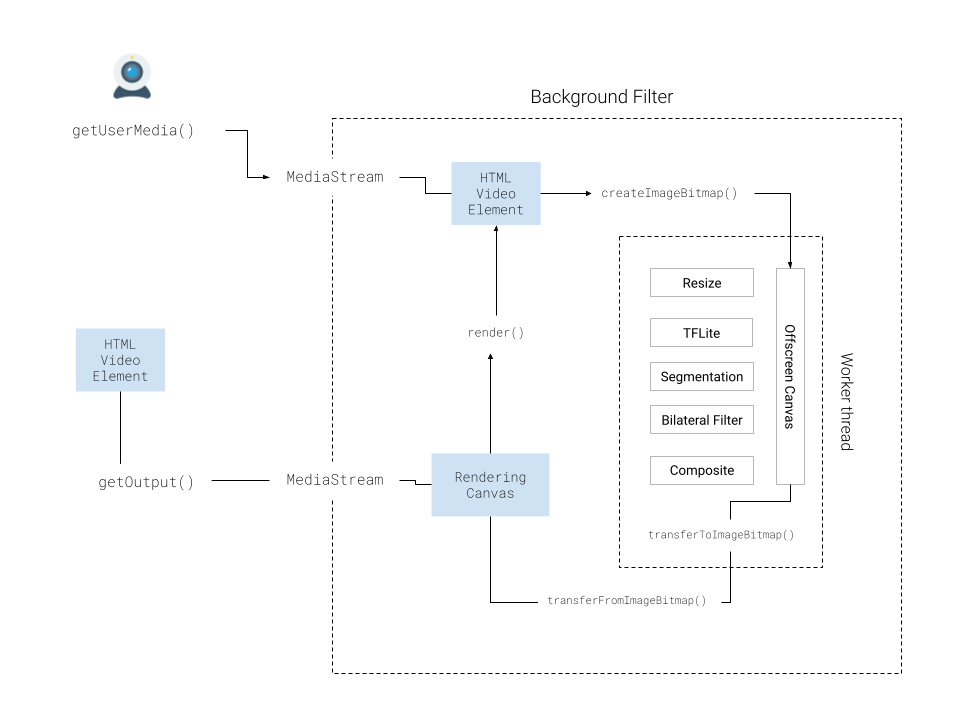

# Virtual Backgrounds Library

This library is a very basic, barebones library for running Virtual Backgrounds, using [Media pipe Selfie](https://github.com/google/mediapipe/tree/master/mediapipe/modules/selfie_segmentation), and code adapted from the [Volcomix repository](https://github.com/Volcomix/virtual-background)

### Architecture

Below you can see an architectura diagram of how the library is structured.

### WebGL Processing

The WebGL processing is handled by the **Pipeline** which houses and manages each step of the virtual background processing:

1. Resizing
2. TFLite inference
3. Reading Segmentation data into WebGL
4. Bilateral Filter
5. Image Compositing

For readability and convenience, we've broken everything done into individual **steps**, as represented by the **Step** class, which handles the shader creation, program creating, setting of attributes, textures and framebuffers needed for processing.

Each step defines it's own shader, as per the needs of that particular step.

Once set up, the pipeline will take in as an input one bitmap, insert the image into the WebGL context, and run it through each stage of the pipeline until the last one, which renders the result to the offscreen canvas.

### Render loop

All of this processing happens within the worker thread, on an Offscreen Canvas. To process the input MediaStream, we first output it to a hidden Video Element.

We then initialize the render loop, which will take in a frame from the Video (via createImageBitmap) and send it to the worker thread.

The worker thread will then feed it to the pipeline (as discussed above, resulting in a rendered result on the offscreen canvas)

The worker thread will then grab the bitmap from the offscreen canvas and send it back to the original thread.

The original thread will then use a bitmapRenderer to output it to the Rendering canvas (Which is on the Main thread, and is seperate from the Offscreen canvas).

The output MediaStream is obtained by running canvas.captureStream() on the *renderingCanvas*, not the *OffscreenCanvas*

### Other controls

As seen in the [docs](docs), there are several other API methods and parameters available, including

* changeBackground - Change the background Image
* frameRate - set the framerate of the video processing
* destroy - Stop processing and clean up all esources
* background='none' - for a 'passthrough' option where you can disable virtual backgrounds without changing the Media Stream
* isSupported

## Stuff that still needs to be done
* Background Blur (including the blur step, and controls for the blur)
* Typescript definitions
* Lots of event and error handling

### Source Code

I developed this code on my own personal device, adapting code from [this repository](https://github.com/Volcomix/virtual-background), but making any modifications independently, on my own, in my own  personal capacity. I am releasing this code under the [MIT License](LICENSE.md)

